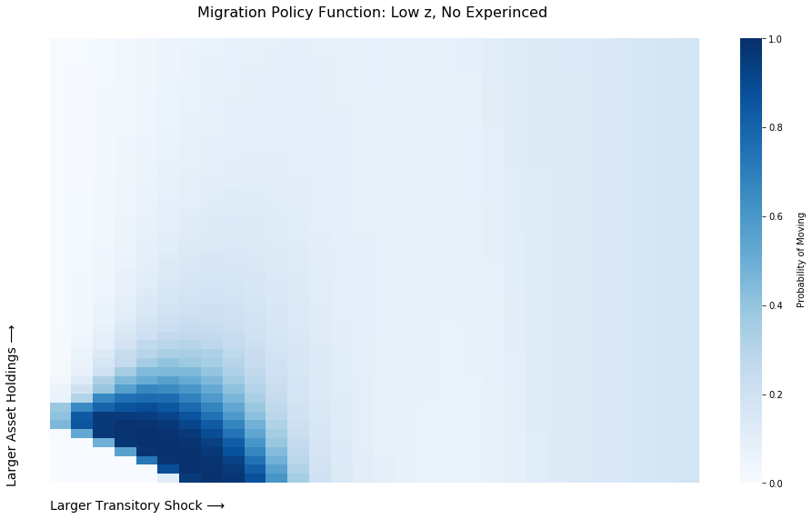

### [The Welfare Effects of Encouraging Rural-Urban Migration](http://www.waugheconomics.com/uploads/2/2/5/6/22563786/LMW.pdf)

<p align="center">

</p>

---
This repository contains code to reproduce results from the paper ["The Welfare Effects of Encouraging Rural-Urban Migration"](http://www.waugheconomics.com/uploads/2/2/5/6/22563786/LMW.pdf). The [``\revision2_code``](https://github.com/mwaugh0328/welfare_migration/tree/master/revision2_code) is associated with changes/clean up for the SECOND REVISON. **IN PROGRESS.**

**Complete explanations of the repository are currently under construction.**

**Software Requirements:** Outside of plotting (and the data analysis of the field experiment) all of this code is in MATLAB and requires the Parallel Computing Toolbox (for computation of the model) and the Global Optimization Toolbox (for calibration). With access to 4cores (Intel(R) Core(TM) i7-8650U CPU) the model is solved in about 120 seconds. Simple modifications to speed up computation are to reduce the productivity grid(s) without loosing much in terms of equilibrium outcomes. For example, in ``preamble.m`` set
```
specs.n_perm_shocks = 24;
specs.n_trans_shocks = 15;
```
and things will run in about 36 seconds on my laptop.

#### Basic Calls
---
**Compute Model:** The most basic call starts inside the [``\revision2_code\calibration``](https://github.com/mwaugh0328/welfare_migration/tree/master/revision2_code/calibration) folder. From there to generate outcomes from the model and the partial equilibrium welfare numbers is here:

```
>> load('calibration_final.mat')

>> analyze_outcomes(exp(new_val),[], 1)
```
Then it should compute everything and then spit out the moments. In ``analyze_outcomes.m`` you can see each step (o) ``preamble.m`` loads fixed parameter values (e.g. the discount factor) and technichal specifications associated with grid and number of simmulations (i) value function iteration in ``rural_urban_value.m`` (ii) simulation to construct stationary distribution ``rural_urban_simmulate.m`` (iii) implementation of experiment (bus ticket ``field_experiment_welfare`` and cash transfer ``cash_experiment_welfare`` and ``experiment_driver`` to simmulat sample paths and then (iv) collect results. The results should mimic (or come very close) to those in Table 2, 6, and 8 in the January 2020 version of the paper.

In the [``\revision2_code\analysis``](https://github.com/mwaugh0328/welfare_migration/tree/master/revision2_code/analysis) folder are saved ``.mat`` files from the run of ``analyze_outcomes.m`` which are used for plotting figures for the paper (policy functions and model fit). A ``.ipynb`` (python) notebooks are used to make the plots.


The ``calibration_final.mat`` contains the final, calibrated parameter values reported in the paper as the array ``new_val``. They are in log units, so to convert to levels take ``exp``. The mapping from the values to their description is given by the structure ``labels`` which, for example,
```
>> labels(3)

ans = "urban TFP"
```
tells us that in the third position of ``new_val`` is urban TFP.

---
**Compute GE Counterfactual with Taxation:** NEED TO CLEAN UP

---

**Compute Effecient Allocation:** NEED TO CLEAN UP

---

**Calibrate the Model:** The calibration routine is implemented by starting inside the [``\revision2_code\calibration``](https://github.com/mwaugh0328/welfare_migration/tree/master/revision_code/calibration)
```
>> calibrate_wrap_tight
```
And then within it you can see how it works. It calls ``compute_outcomes.m`` which is similar to the ``analyze...`` file above but is optimized for the calibration routine.  The key to get this thing to fit was using the ``ga`` solver which is essentially a search of the entire parameter space in a smart way. The current settins have a tight bounds on the parameter space. The original calibration routine had very loose bounds. Alternative approaches with different minimizers (``patternsearch`` ``fminsearch`` (with and without random start) and some ``NAG`` routines) are in the ``graveyard`` folder.

---

#### Complete Contents

**under construction**
