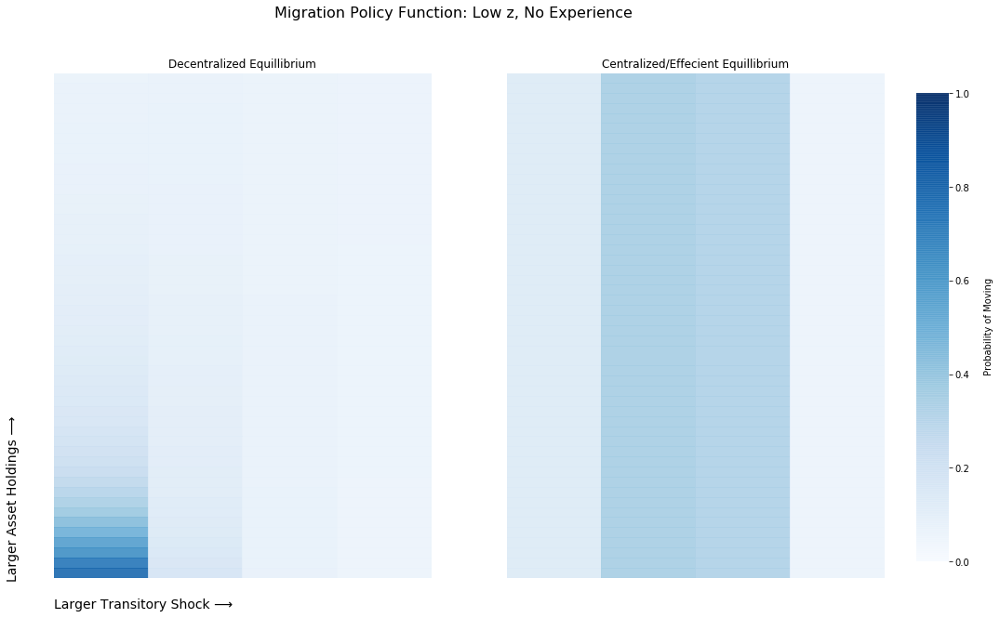
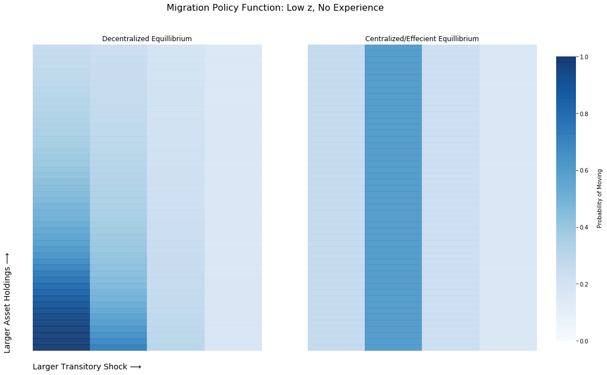

**Effecient Allocation**

This outlines the code and some of the results. Lot's of stuff to think about here.

So the main code is:

```
 solve_effecient
 ```
 and this will run and execute everything. It takes as given the optimized allocation. I have some different code doing that and as of now, it essentially is not making any new progress. It first runs the ``analyze_outcomes``, then run some individual parts to grab policy functions and such. Then two results are presented:

 1. Provide full insurance but keep the allocation fixed (moving policies). So everyone is moving around as they are in the calibrated/decentralized allocation, but here consumption is reallocated so that marginal utility of consumption is equated for each season. Recall that in the planners problem there are essentially two first order conditions. One equates marginal utility of consumption with the multiplier on the constraint. And because the constraint is different for each season, this is why it's only equated within seasons. Also, just recall, that muc differs based on experience, so that is taken into account. So this experiment is fixing the insurance issue in the economy, but not optimally setting how people should move across space:


 ```
 %%%%%%%%%%%%%%%%%%%%%%%%%%%%%%%%%%%%%%%%%%%%%%%%%%%%%%%%%%%%%%%%%%%%
 Aggregate Statistics
 Average Rural Population
     0.5983

 Seasonal Migrants
     0.3183

 Experince
     0.2311

 Social Welfare: All, Rural, Urban
   -18.9044  -18.9768  -18.7966

 Standard Deviation of Marginal Utility
    1.0e-12 *

     0.0941    0.2203

 Implied Wage Gap
     1.9082

 %%%%%%%%%%%%%%%%%%%%%%%%%%%%%%%%%%%%%%%%%%%%%%%%%%%%%%%%%%%%%%%%%%%%
 Accounting
 Monga: Production, Consumption, Moving Costs, Utility Cost
     0.9158    0.9124    0.0034    0.0288

 Not Monga: Production, Consumption, Moving Costs, Utility Costs
     1.3603    1.3414    0.0189    0.0018

 Resource Constraint: Monga, Non Monga
    1.0e-11 *

     0.0297    0.1845

 Al, Welfare Gain in %: From Decentralized to Full Insurance, Fixed Allocation
    36.9622
```
Several things to notice. First, rural population and migration rates (all, not just mushfiq's) and the wage gap are exactly as they are in the calibration/decentralized allocation. Now what is different is that marginal utility is equated. So that's what the standard deviation of it reports and it's zero. But the key thing where is that welfare went up a lot, by 37 percent. So this takes a guy, behind the vale, in the calibrated economy and asks how much would he get, again, behind the vale, in this economy with the new allocation. And again, it's purely because full insurance/risk sharing is implemented. The pie is diviede up in a better way, but the size of the pie is the same.


2. Now let's implement the fully efficient allocation. So this is equating marginal utility of consumption AND finding the optimal migration rates. We need to make this point clear, this last part is not trivial. With the 5 transitory shocks and 24 permanent shocks, this worked out to picking 1440 migration rates. I think we are a good as we can get, but the thing that generated the most systematic progress was (i) randomly try different migration policies from the calibrated economy and use the one that gave the highest social welfare as a starting point and then (ii) use ``fminsearch`` with tight restart (so stop after 3000 function evaluations) and restart it. This process eventually lead to the point that is evaluated below:

```
Now Compute the Efficient Allocation...
%%%%%%%%%%%%%%%%%%%%%%%%%%%%%%%%%%%%%%%%%%%%%%%%%%%%%%%%%%%%%%%%%%%%
Aggregate Statistics
Average Rural Population
    0.3860

Seasonal Migrants
    0.2475

Experience
    0.3359

Social Welfare: All, Rural, Urban
  -18.4713  -18.4640  -18.4759

Standard Deviation of Marginal Utility
   1.0e-12 *

    0.5365    0.3568

Implied Wage Gap
    1.4534

%%%%%%%%%%%%%%%%%%%%%%%%%%%%%%%%%%%%%%%%%%%%%%%%%%%%%%%%%%%%%%%%%%%%
Accounting
Monga: Production, Consumption, Moving Costs, Utility Costs
    0.9509    0.9485    0.0025    0.0152

Not Monga: Production, Consumption, Moving Costs, Utility Costs
    1.2942    1.2840    0.0102    0.0012

Resource Constraint: Monga, Non Monga
   1.0e-12 *

   -0.6630   -0.4283

Elapsed time is 4.955583 seconds.
Al, Welfare Gain in %: From Decentralized to Centralized/Effecient Allocaiton
   40.1735
 ```

 First, notice that the welfare gains here are about 40 percent, so finding better migration rates etc. are about 10 percent of the total welfare gains possible. Most interesting is how the allocation changes. The Rural area depopulates from 60 percent to 40 percent, seasonal migration decreases, and the wage gap falls by about 25 percent. Here is a look at those policy functions suggesting what is going on here:

 <p align="center">
 
 </p>

 The left hand side is the calibrated economy. Note we don't see the constrained guys, because the shock grid is too sparse and it turns out to matter because there are never many constrained guys anyways. So we see all these guys moving when the have bad shocks/no assets.

 The right hand side is the efficient economy. Note here, while asset levels are shown, they don't matter at all. Just vertical lines here. Now notice that all that intense migration at the bottom disappears. It's only guys in the middle that are asked to migrate and it's not as much as before.

 Here is the medium z guys

 <p align="center">
 
 </p>

And it's the same deal. All the intensity at the bottom end goes away.

---

** \alpha = 0.995***

First, remember that everything in the initial allocation is always the same. There is never a change given the way things are set up. The only thing changing is the efficient allocation.

```
Aggregate Statistics
Average Rural Population
    0.4572

Seasonal Migrants
    0.2232

Experience
    0.2869

Social Welfare: All, Rural, Urban
  -18.6825  -18.6598  -18.7017

Standard Deviation of Marginal Utility
   1.0e-12 *

    0.0904    0.3743

Implied Wage Gap
    1.6458

%%%%%%%%%%%%%%%%%%%%%%%%%%%%%%%%%%%%%%%%%%%%%%%%%%%%%%%%%%%%%%%%%%%%
Accounting
Monga: Production, Consumption, Moving Costs, Utility Costs
    0.9299    0.9272    0.0027    0.0159

Not Monga: Production, Consumption, Moving Costs, Utility Costs
    1.3028    1.2919    0.0109    0.0016

Resource Constraint: Monga, Non Monga
   1.0e-12 *

    0.0439    0.6226

Elapsed time is 2.412718 seconds.
Al, Welfare Gain in %: From Decentralized to Centralized/Effecient Allocaiton
   38.5888
```

---

** \alpha = 0.70***


```
Aggregate Statistics
Average Rural Population
    0.3198

Seasonal Migrants
    0.2207

Experince
    0.3593

Social Welfare: All, Rural, Urban
  -18.1865  -18.1597  -18.1991

Standard Deviation of Marginal Utility
   1.0e-12 *

    0.5764    0.4755

Implied Wage Gap
    1.2366

%%%%%%%%%%%%%%%%%%%%%%%%%%%%%%%%%%%%%%%%%%%%%%%%%%%%%%%%%%%%%%%%%%%%
Accounting
Monga: Production, Consumption, Moving Costs, Utility Costs
    0.9684    0.9653    0.0031    0.0130

Not Monga: Production, Consumption, Moving Costs, Utility Costs
    1.3020    1.2932    0.0089    0.0016

Resource Constraint: Monga, Non Monga
   1.0e-12 *

    0.9415    0.2331

Elapsed time is 2.201875 seconds.
Al, Welfare Gain in %: From Decentralized to Centralized/Effecient Allocaiton
   42.3690
   ```
